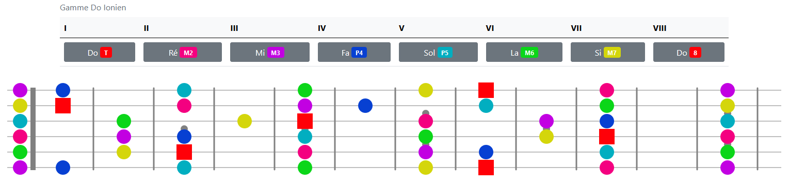

# Harmonize
Un outil pour les guitaristes

Il y a quelques mois de cela j'ai commencé à développer ce petit outil permettant de retrouver toutes les gammes dans tout les modes dérivés du mode majeur (IONIEN), je me suis lancé pour objectif de ne pas référencer les gammes dans un tableau mais de créer un algorithme qui pourrait calculer la gamme demandée en fonction du mode choisi.

Je précise toutefois que je ne suis pas développeur, je bidouille un peu mais je ne connais pas les bonnes pratiques en matière d'organisation du code ou de développement. 

Voici donc la première version de cet outil, pour l'instant seule la gamme est affichée, ainsi que le schéma de celle-ci sur la guitare.

N'étant pas initié aux bonnes pratiques de développement, je dois en premier lieu faire du propre dans ce code, le rendre plus lisible et plus concis (1760 lignes, commentaires et espaces inclus).

Voici les technologies utilisées:

HTML - CSS (Bootstrap) - Javascript - PHP

## Roadmap
- Clarification du code et organisation des fichiers du projet
- UX/UI (design de la page d'affichage des résultats)
- Ajout de l'harmonisation de la gamme demandée ainsi que des schémas relatifs (en cours)
- Ajout des enrichissements possibles (Renversements, Drops, enrichissements)
- Ajout de cadences possibles
- Ajout des gammes relatives à la gamme demandée
- Choix de l'instrument (guitare, piano,..) et schémas

Je suis à l'écoute de toute suggestion permettant d'améliorer toute ou partie de cette application. 

Merci

